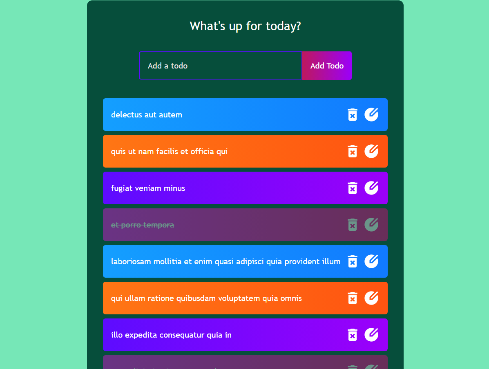

# Todo React App
A simple Todo application built using React.js, Axios, and JSONPlaceholder API.

## Screenshots


## API Used
This application uses [JSONPlaceholder API](https://jsonplaceholder.typicode.com/) as a fake REST API for demonstration purposes.

## How the API works
The API has several endpoints, but in this application, we are using the following endpoints:

- `GET /todos`: This endpoint returns an array of todo objects.

- `POST /todos`: This endpoint is used to add a new todo. It accepts a JSON object containing the todo information as the request body.

## Features
- Add new todo
- Display existing todos
- Cross off completed todos

## Development
1. Clone the repository
```
git clone https://github.com/vikramkbgs/todo-react-app.git
```
