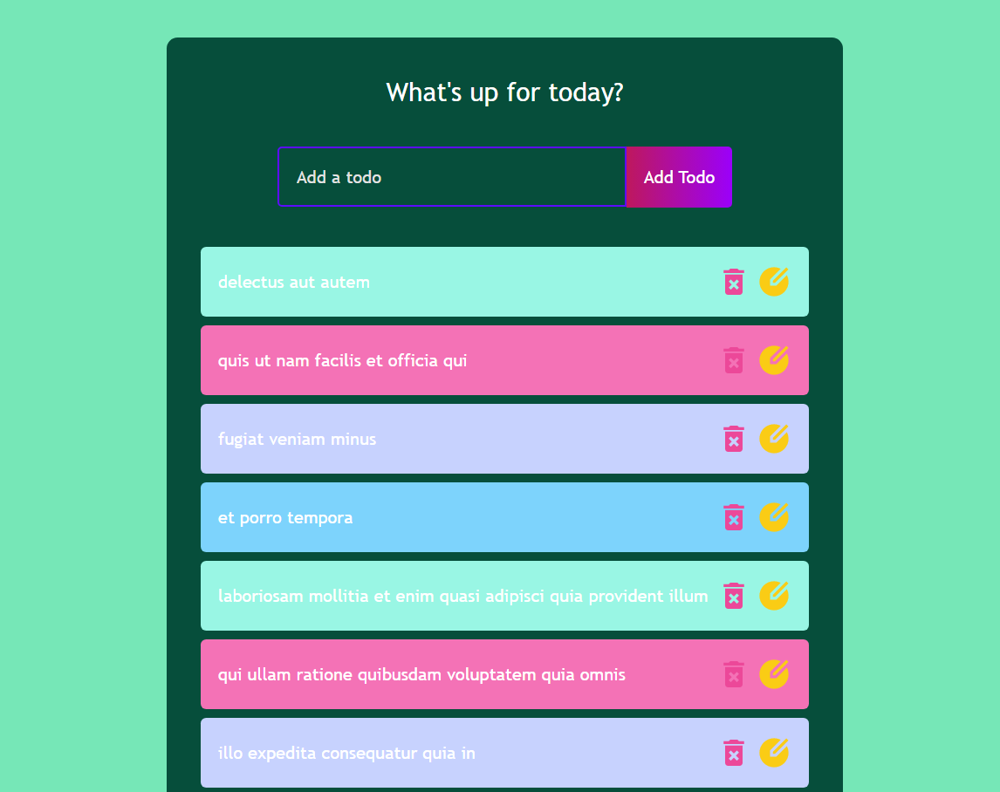

# Todo React App
A simple Todo application built using React.js, Axios, and JSONPlaceholder API.

## Screenshots


## API Used
This application uses [JSONPlaceholder API](https://jsonplaceholder.typicode.com/) as a fake REST API for demonstration purposes.

## How the API works
The API has several endpoints, but in this application, we are using the following endpoints:

- `GET /todos`: This endpoint returns an array of todo objects.

- `POST /todos`: This endpoint is used to add a new todo. It accepts a JSON object containing the todo information as the request body.

- `PUT /todos/{id}`: This endpoint is used to update an existing todo. It accepts a JSON object containing the updated todo information as the request body and the todo's id as a path parameter.

- `DELETE /todos/{id}`: This endpoint is used to delete a todo. It requires the todo's id as a path parameter.

In this app, the axios library is used to make HTTP requests to the JSON Placeholder API. To get the list of todos, the GET request is made to the URL `https://jsonplaceholder.typicode.com/todos`. To add a new todo, the POST request is made to the same URL with the new todo data as the request body. To update a todo, the PUT request is made to the URL `https://jsonplaceholder.typicode.com/todos/{id}` with the updated todo data and the todo's id as the request body and path parameter. To delete a todo, the DELETE request is made to the URL `https://jsonplaceholder.typicode.com/todos/{id}` with the todo's id as a path parameter.

## Features
- Add new todo
- Display existing todos
- Cross off completed todos
- Delete existing todos
### Each feature is explained in detail below:

- Add new todo: This feature allows the user to add a new todo item to the list. The user can enter the todo description and press the "Add" button to add it to the list.

- Display existing todos: This feature displays all the existing todos in the list. The user can view the description of each todo item.

- Cross off completed todos: This feature allows the user to mark a todo as complete. The user can click on the todo item to cross it off.

- Delete existing todos: This feature allows the user to delete an existing todo from the list. The user can click the "Delete" button next to the todo item to remove it from the list.

## Development
1. Clone the repository
```
git clone https://github.com/vikramkbgs/todo-react-app.git
```
2. Install the dependencies
```
npm install
```
3.Start the development server
```
npm start
```
4. Access the application in your browser at http://localhost:3000

## Live Demo
[Check out the live demo here](https://todo-react-app.vikramroy1.repl.co/)


## Contributions
If you would like to contribute to this project, please fork the repository and make a pull request with your changes.

## License
This project is licensed under the MIT License.
